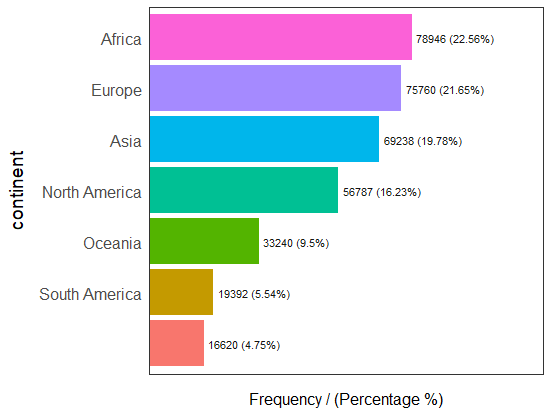
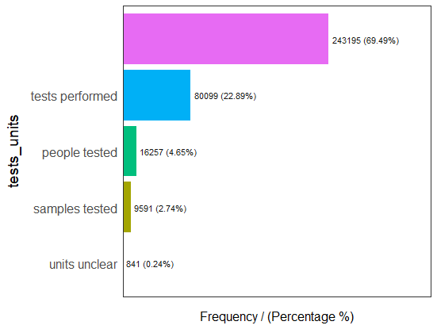
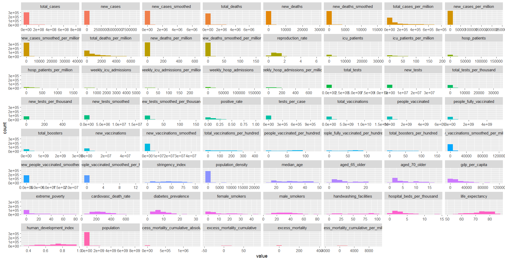

# Exploratory Data Analysis of Covid-19 Dataset

## Table of Contents
  - [Objective](#objective)
  - [Dataset](#dataset)
  - [Tools](#tools)
  - [Methodology](#methodology)

## Objective

This project involves analyzing the Covid-19 dataset to uncover trends in vaccination rates and related factors.

## Dataset

The dataset of COVID-19 from Kaggle(https://www.kaggle.com/datasets/tunguz/data-on-covid19-coronavirus) contains the following key features:

- Continent: Name of the Continent
- Location: Country
- Date: Date (YYYY-MM-DD)
- total_cases: Total cases reported in a specific date
- total_vaccinations:Total vaccinations in a specific date
- people_vaccinated_per_hundred:Percentage of people vaccinated in a specific date
- people_fully_vaccinated_per_hundred:Percentage of people fully vaccinated in a specific date

## Tools

- R libraries
  - Tidyverse, funModeling, Hmisc for exploratory data analysis
  - ggplot2 for data visualization

## Methodology

### 1. Data Collection and Preparation

The dataset was imported using R, and an initial overview was conducted to understand its structure, variables, and size. A combination of df_status, freq, and plot_num functions was used to profile the dataset, assess data types, identify missing values, and examine the distribution of categorical and numerical variables.

For example, with freq we can see the distribution of the categorical variables such as continent and test_units and observe wether the variables have missing values:

Likewise, with plot_num we can observe the distribution of numerical variables:

### 2. Data Cleaning and Transformation

### 3. Data Visualization

## Insights and Findings

